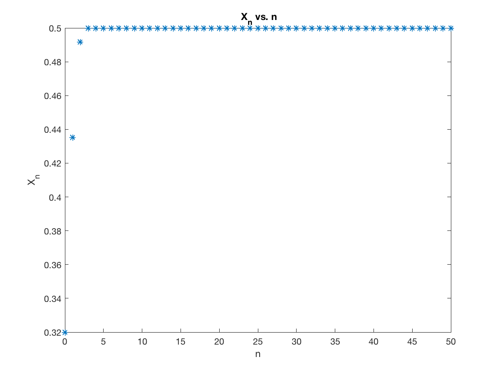
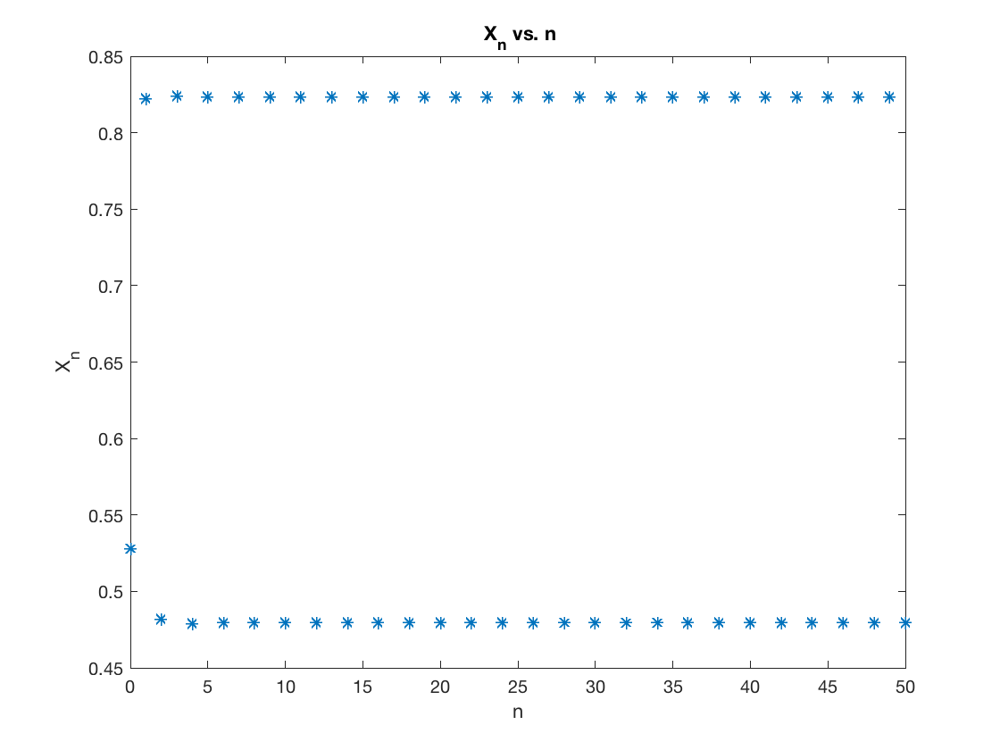
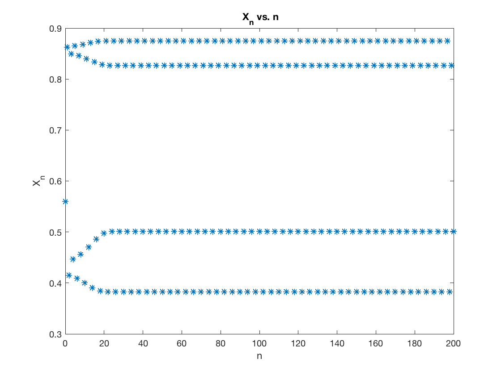
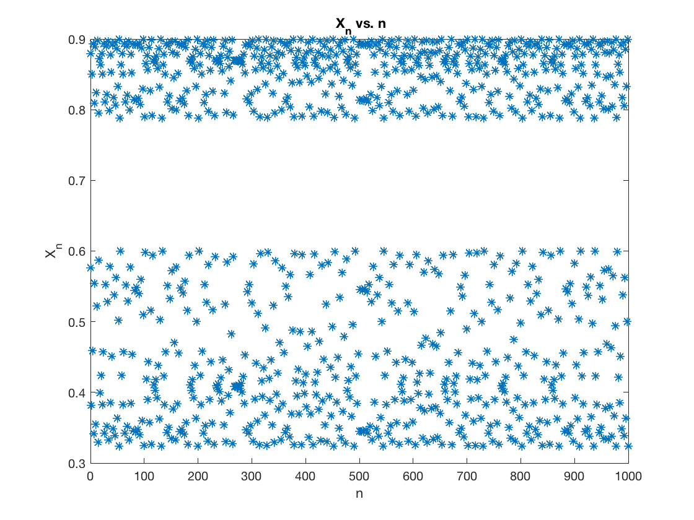
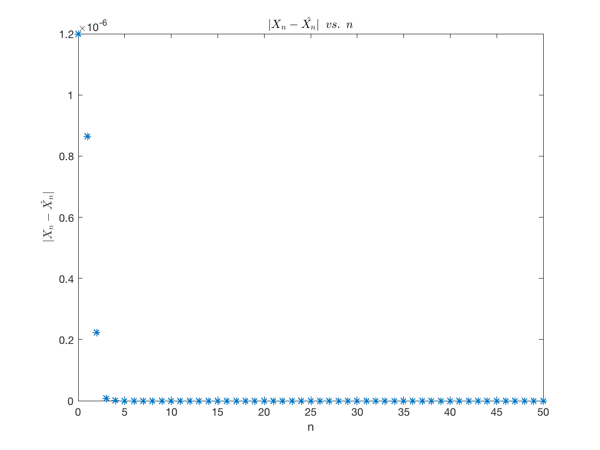
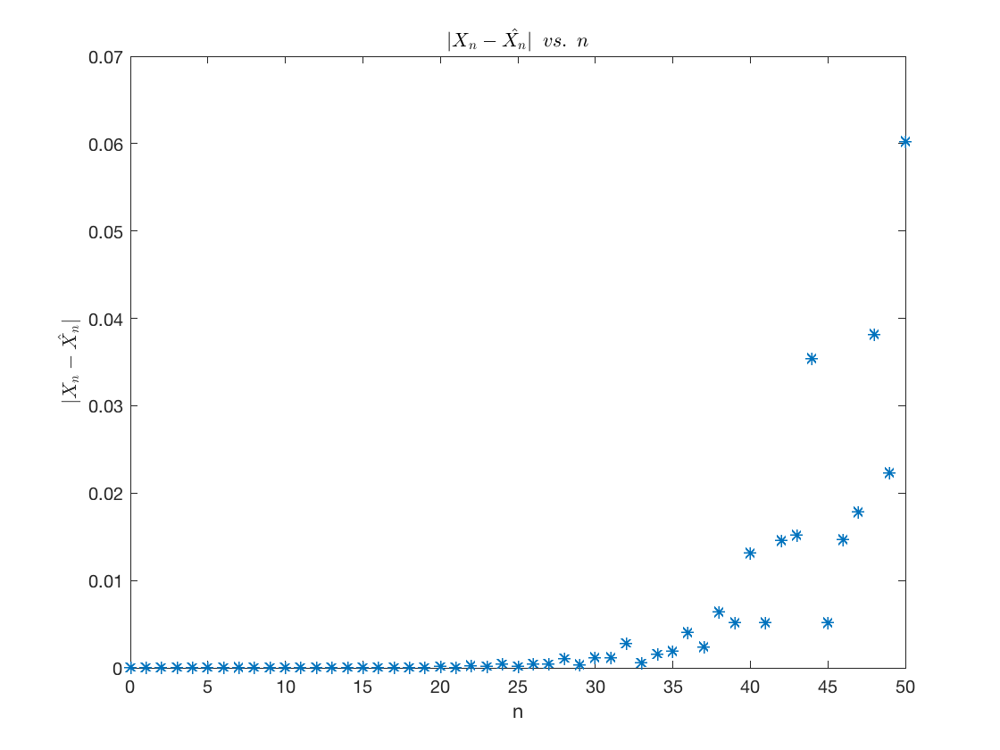
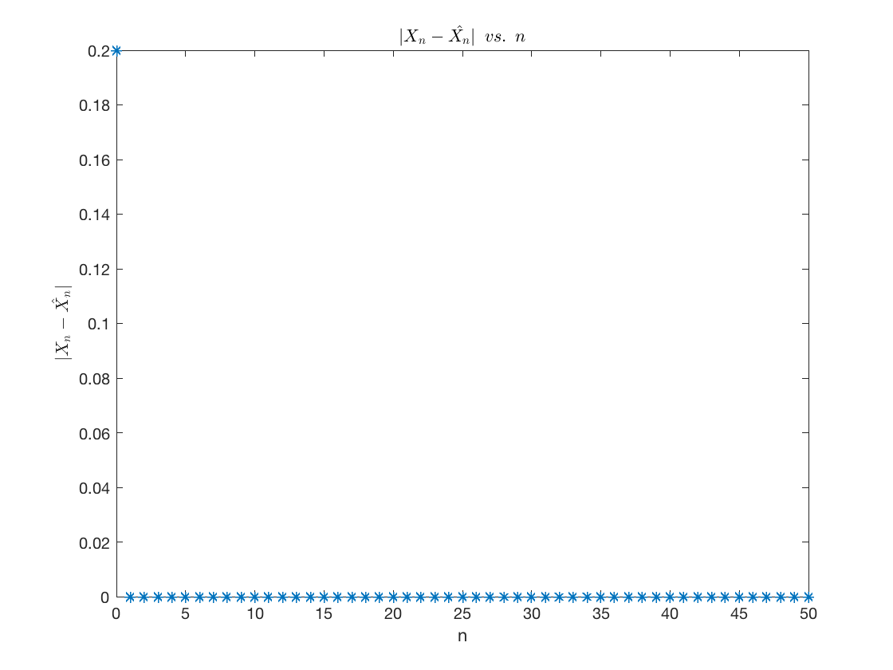
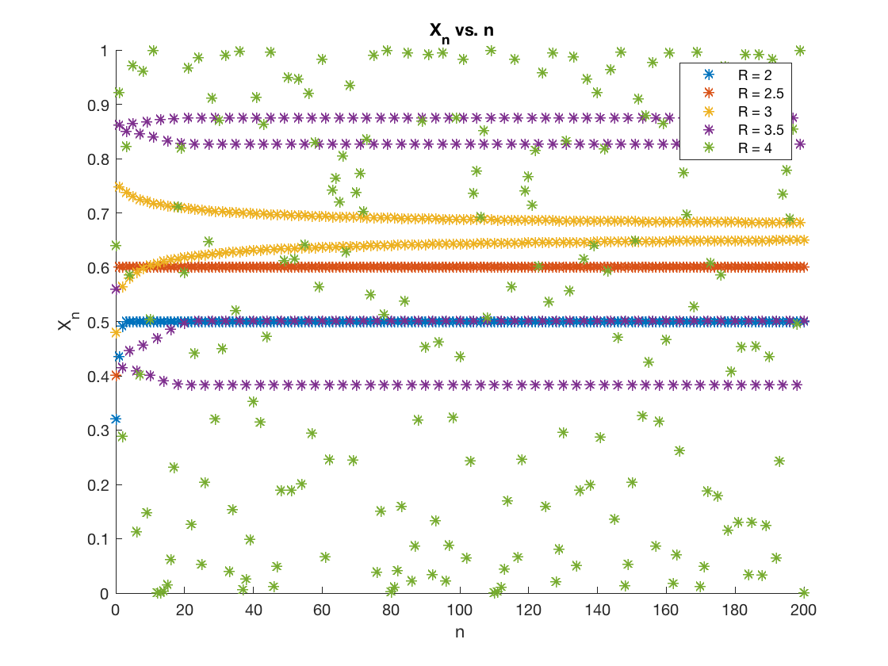
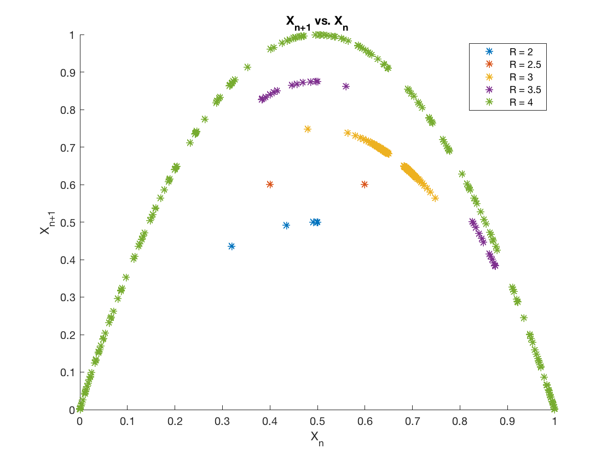
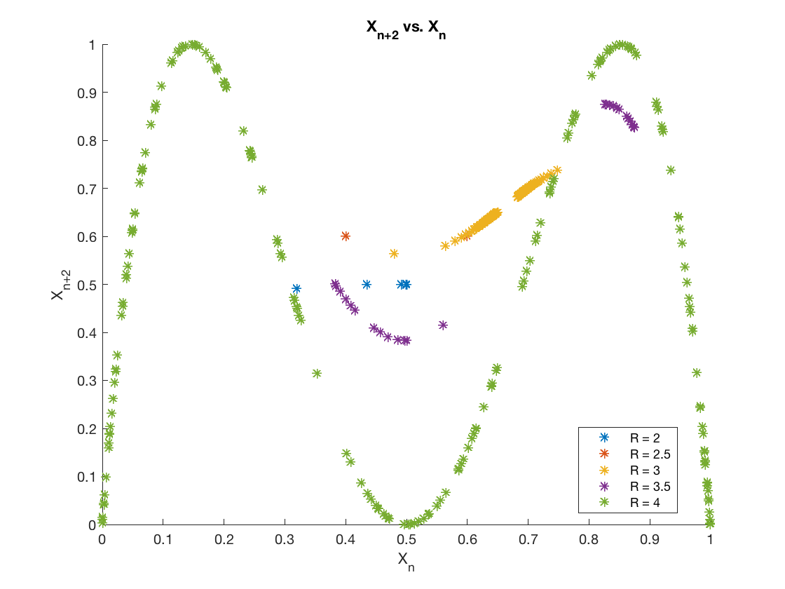

# Logistics Map

To get a better understanding of the logistic map - $X_{n+1} = R x_n(1-x_n)$, the values of $R$ and the initial condition $x_0$ were altered to see what changes they would inflict on the dynamical system.

## Effect of the Parameter R:
 First, the values of R were adjusted. In this logistics map, R represents the ratio of rabbits eaten to rabbits born. When the value of R was varied from 2 to 4, interesting patterns arose. It was noticed that for values of R: ($2 - \approx3$), the values of $x_n$ converged to a fixed point. This can be noticed in the image below:
 
|  |  |
|:-------------------------:|:-------------------------:|
| $R = 2,$ $x_0 = 0.2$      | $R = 3,$ $x_0 = 0.2$      |
 

 The iterations needed for $x_n$ to converge increased as R was increased from 2 - 3. This is due to the longer transient. This is illustrated as $x_n$ is on the path to converge to a single fixed point, but requires more than 1000 iterations (n).  
 
 When R was further increased, the pattern changed. The system then went from a single fixed point system to a two period, limit cycle or periodic orbit. This can be displayed at values of R in the range of R = (3-3.4). A depiction of this is illustrated bellow: 

|  |
|:------------------------------:|
| $R = 3.3,$ $x_0 = 0.2$         |
 

This image shows a bifurcation that arises when the parameter R is changed. The period of this system changes again when R is further increased to R = 3.5. Once again a bifurcation happens as the period changes from 2 to 4. This is illustrated in the image below:

|  |
|:------------------------------:|
| $R = 3.5,$ $x_0 = 0.2$         |
 

 Lastly, if the value of R is further increased -  chaotic behavior begins to be apparent. When R = 3.6 two chaotic or "strange" attractors can be seen by increasing the iterations. These chaotic attractors are displayed in the following image:

|  |
|:------------------------------:|
| $R = 3.6,$ $x_0 = 0.2$         |
 

While the bands of similar patters centered around what seems to be two values seems to be apparent, it can be further determined that this system is indeed chaotic for R = 3.6, by checking the difference in $x_n$ values for different initial conditions. To display the effect that a different initial conditions has on the system, we will check the average difference in the values of of $x_n$ for the case where $x_0 = 0.2$ and $\hat{x_0} = 0.200001$. Where the average absolute difference was determined by the equation:  

$$
    \frac{1}{n} \sum\limits_{i=0}^n |x_i - \hat{x_i}|
$$

When doing so, it was noticed that even though the difference fluctuated, the average difference remained nearly the same. For the case where 500 iterations was taken, the average difference as 0.0580. When increasing the iterations to 500,000 - the average difference only increased to 0.0686. This shows that the system is indeed chaotic since this average difference remains nearly constant even over 500,000 iterations. This means that even though the pattern results in a differing path sequence, the overall structure is the same. <br/ >

## Changes in Initial Conditions:
To gain better insight on the sensitivity of the system to the initial conditions, $x_0$, at different values of R, a plot of the difference, $|x_n - \hat{x_n}|$ was utilized. This difference will show how the system progresses as the iterations are increased. Chaotic systems are very sensitive to initial conditions and will have an increasing difference as iterations are increased. 
It was displayed above that values of R = 3.6, correlated to a chaotic attractor. This chaotic behavior should be very sensitive to initial conditions, where the difference,$|x_n - \hat{x_n}|$, should increase with iterations. This behavior is displayed below. Also displayed is a plot of the difference for values of R that correlated to a fix point attractor (R = 2 in this case). As expected the small change in initial conditions has a smaller effect, where the system converges to having a difference of 0.  

|                   |                     |
|:---------------------------------------------:|:--------------------------------------------------:|
| $R = 2,$ $x_0 = 0.2,$ $\hat{x_0} = 0.200001$  | $R = 3.6,$ $x_0 = 0.2,$ $\hat{x_0} = 0.200001$     |
 

Lastly, when fixing the value of R to 2.5, correlating to a system that converges to a fixed point attractor, and the initial condition $x_0$ was varied - it was noticed that the system converged to the same value. This is displayed by once again utilizing the absolute difference, $|x_n - \hat{x_n}|$. This time, $\hat{x_n}$ correlates to the initial condition, $x_0 = 0.4$. This initial conditions is very different from the original initial condition $x_0 = 0.2$. Even though these initial conditions are very different - the absolute difference still converged to zero with a reasonably short transient. This is displayed below:  

|                |
|:------------------------------------------------:|
| $R = 2.5,$ $x_0 = 0.2,$ $\hat{x_0} = 0.4$        |
 

## Phase Plots:
Important to noticing trends of dynamical systems, the following phase plots are used to display the progression of the state variable, $x_n$. The state space plots are provided for varying R from 2 - 4, with a fixed $x_0 = 0.2$. The plots illustrating $x_{n+1}$ vs. $x_{n}$, show that as R increases, so does the slope where the value of $x_{n+1}$ = $x_{n}$ on the curve. The steeper this slope tangent to the curve is, the less stable the system becomes. The plot of $x_{n+2}$ vs. $x_{n}$ shows two cycles of the logistic map and is also displayed below:  
 
|                 |
|:------------------------------------------------:|
| $x_n$ vs. $n$                                    |
 

|                 |
|:------------------------------------------------:|
|   $x_{n+1}$ vs. $x_{n}$                          |
 

|                 |
|:------------------------------------------------:|
| $x_{n+2}$ vs. $x_{n}$                            |
 

 When $R > 4$, $x_n$ goes off to negative infinity. The state variable $x_n$ represents the ratio of foxes to rabbits, where at $R > 4$, the system becomes unstable. This correlates to number of foxes growing to a point where there are too many foxes and they eat all the rabbits, which in turn gives them no food and they end up dying off as well. This limit tends to infinity as the rabbits all die out first giving some number of foxes over a number approaching zero - which tends towards a ratio of infinity.
 